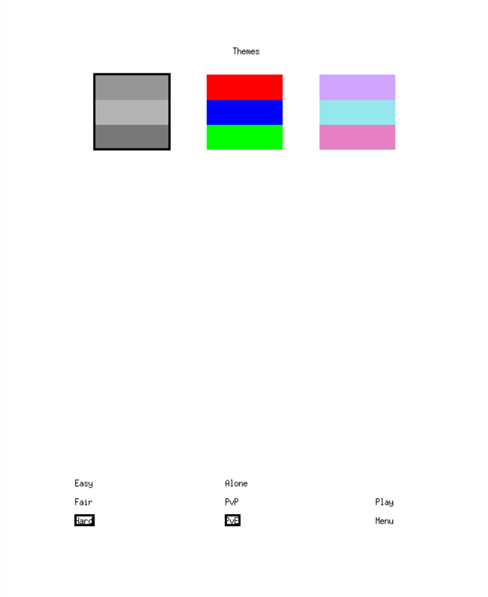
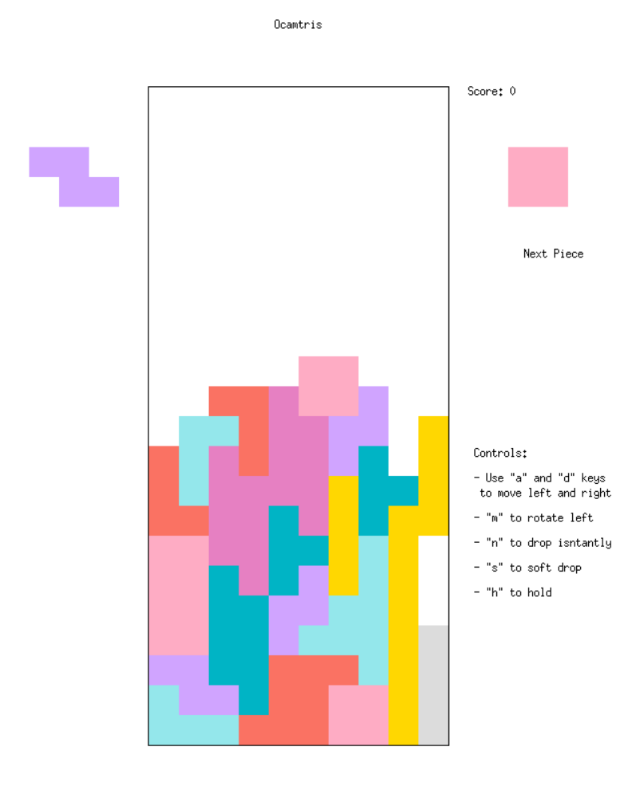
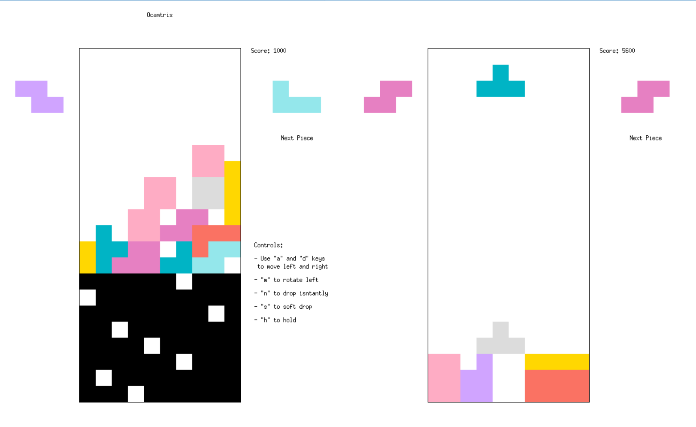

# Ocamtris

A clone of Tetris made in OCaml made for Cornell CS 3110's final project.  
Developers: Noah Rebei (nr285), Jacobo Carreon (jic56), Noah Solomon (njs99), Richard Kang (rk695)

Install instructions are located in <a href="https://github.coecis.cornell.edu/nr285/ocamtris/blob/main/INSTALL.md">INSTALL.md</a>

## Screenshots

